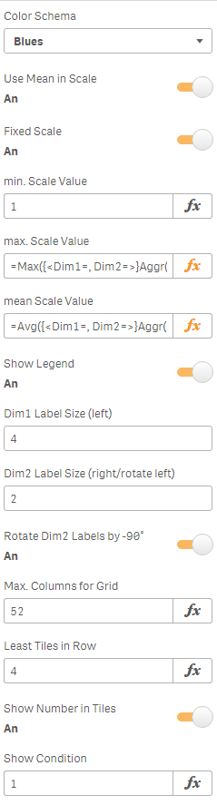
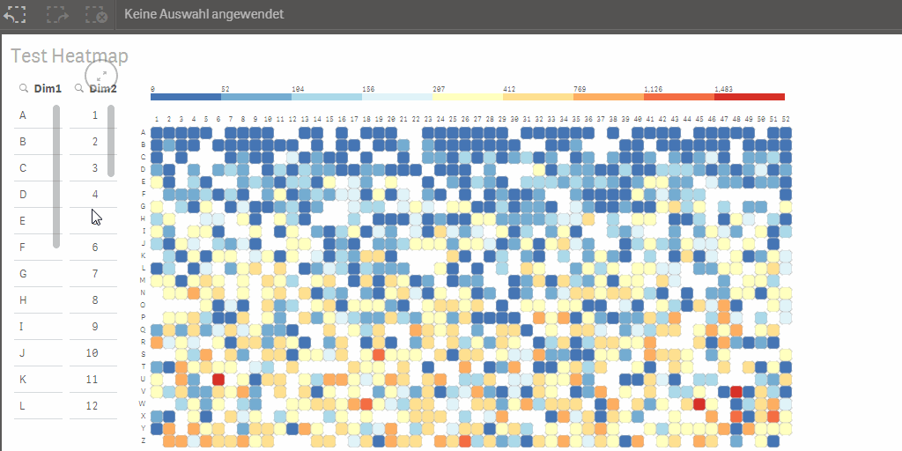

# Qlik Heatmap Chart

This extension shows a matrix of colored tiles by two dimensions. The 1st dimension is used for the rows (variable, scrollbar if exceeds container element), 2nd dimension is used for the columns and should have a fixed maximum fitting to the container.

---

- [Getting started](#getting-started)
- [Developing the extension](#developing-the-extension)
- [Limitations](#limitations)
- [Original author](#original-author)

---

# Getting Started

## Installation

1. Download the extension zip, `qlik-heatmap-chart.zip`, from the latest release(https://github.com/qlik-oss/QlikSense_Extension_2DimHeatmap/releases/latest)
2. Install the extension:

   a. **Qlik Sense Desktop**: unzip to a directory under [My Documents]/Qlik/Sense/Extensions.

   b. **Qlik Sense Server**: import the zip file in the QMC.

## Introduction

For best adoption use a numerical dimension for the 2nd dimension (columns) with a very short label like week (label: 01..53)

The extension and example app was created during the Qonnections 2015 Hackathon (Team Sixth Sense: Torben Seebach, Matthieu Burel, Ralf Becher)

After that I've added a bit more responsiveness for the grid layout, labels, font sizes and enable scrolling.

You can make a selection by one dimension by clicking on a dimension label (row or column) or a selection by two dimensions by clicking on a tile.

Also, you can use a lasso to make a two-dimensional selection:

## Additional Properties:

1. **Color Schema**: color schema for measure visualization on tiles
1. **Use Mean in Scale**: calculate mean of data set and use it as middle value in color scale
1. **Fixed Scale**: use min/max/mean expressions to define a fixed color scale independent from data set, esp. independet from selections, means selected tiles will have consistent color
1. **min. Scale Value**: expression for minimal value to define start of color scale
1. **max. Scale Value**: expression for maximal value to define end of color scale
1. **mean Scale Value**: expression for mean value to define middle of color scale, set to 0 when no mean should be used
1. **Show Legend**: show/hide legend
1. **Dim1 Label Size (left)**: max. amount characters shown of 1st dimension label (from left)
1. **Dim2 Label Size (right/rotate left)**: max. amount characters shown of 2nd dimension label (from right, or from left if rotated)
1. **Rotate Dim2 Labels by -90°**: rotate labels counterclockwise, better for more readable labels above small tiles
1. **Max. Columns for Grid**: expression to get max. amount of values of 2nd dimension to have a more stable grid layout
1. **Height Factor**: a multiplier to change rectangular high of tile (default=1, 100% - same size as width)
1. **Least Tiles in Row**: filter rows (1st dimension) with less than minimum amount of tiles (default=1; no filtering)
1. **Localized Number Format**: use a localized number format for decimal and thousands separator
1. **Show Numbers in Tiles**: shows the measure number in each tile (only useful for small numbers, depending on tile sizes)
1. **Render Tiles w/ Border**: switch tile border on/off (default=on)
1. **Tile Opacity**: set opacity to tile color (default=1, no opacity)
1. **Lasso Selection**: activate lasso selection (default=on)
1. **Show condition**: QlikView-like show condition; useful if you have a measure or selection which doesn't gives you values. If condition <> 1 at least the labels of 1st and 2nd dimension are shown but no tiles.

## Sample Application:

Qlik Hackathon 2015 Start.qvf - Uses data from Medair to analyse Ebola Outbreak in Sierra Leone.

This app uses also Qlik Sense Extension VariableButton: https://github.com/asierfer/QlikSense-Ext-VariableButton

With class() function as measure dimension you can have a awesome fast backend calculated binning!

Rotation of Dim2 Labels and proper measure formattings:

# Developing the extension

If you want to do code changes to the extension follow these simple steps to get going.

1. Get Qlik Sense Desktop
1. Create a new app and add the extension to a sheet.
2. Clone the repository
3. Run `npm install`
4. Change the `buildFolder`in `server.config.json` to be your local extensions folder..
5. You now have two options. Either run the watch task or the build task. They are explained below. Both of them default to development mode but can be run in production by setting `NODE_ENV=production` before running the npm task.

   a. **Watch**: `npm run watch`. This will start a watcher which will rebuild the extension and output all needed files to the `buildFolder` for each code change you make. See your changes directly in your Qlik Sense app.

   b. **Build**: `npm run build`. If you want to build the extension package. The output zip-file can be found in the `buildFolder`.

# Limitations
See [Limitations](docs/LIMITATIONS.md)

# Original Author

**Ralf Becher**

+ [irregular.bi](http://irregular.bi)
* [twitter/irregularbi](http://twitter.com/irregularbi)
* [github.com/ralfbecher](http://github.com/ralfbecher)

***